% Apartment Rental Price in Chicago Using Craigslist Listings
% D. Rimal

## Outline

- [Motivation](#motivation)
- [Data Collection](#data-collection)
- [Data Processing](#data-processing)
- [Exploratory Analysis](#exploratory_analysis)
- [Modeling](#modeling)
- [Model Deployment](#model-deployment)
- [Summary](#summary)

#

## Motivation

---

- Goal: Develop end-to-end data science project to model apartment rental price in Chicago within the city limit using craigslist data.
- End product: A flask application to predict rental price for some user chosen criteria


#

## Data Collection


<div class="right">

- Source: [Chicago craigslist](https://chicago.craigslist.org/search/chc/apa?)
- Used Scrapy and wrote a spider to crawl through craigslist pages [see scraping project](https://github.com/drimal/webscraping/tree/master/craiglistscraper)
- Scraped over 5k listings over 2 day period in April 2019
- Data pipelined to mongo db atlas for storage
</div>
---

## Example Code

```
def parse(self, response):
    # Get listings from the response
    postings = response.xpath(".//p")

    for i in range(len(postings)):
        item = craiglistscraperItem()
        item['postid'] = int("".join(postings[i].xpath(".//@data-id").extract()))
        item['title'] = "".join(postings[i].xpath(".//*[@class='result-title hdrlnk']/text()").extract())
        item['neighborhood'] = "".join(postings[i].xpath(".//span[@class='result-meta']/span[@class='result-hood']/text()").extract())
        item['postdate'] = "".join(postings[i].xpath(".//*[@class='result-date']/text()").extract())
        item['link'] = "".join(postings[i].xpath(".//*[contains(@class, 'result-title hdrlnk')]/@href").extract())
        price = "".join(postings[i].xpath(".//span[@class='result-meta']/span[@class='result-price']/text()").extract()).replace('$', '')
        item['price'] = float(price)
        # parsing response to follow the posting link for more detailed information
        follow = item['link']

        request = scrapy.Request(follow, callback=self.parse_from_item_detail_page)
        request.meta['item'] = item
        yield request

def parse_from_item_detail_page(self, response):
    item = response.meta['item']
    latparser = response.xpath("//div[contains(@id,'map')]")
    item['latitude'] = ''.join(latparser.xpath("@data-latitude").extract())
    item['longitude'] = ''.join(latparser.xpath("@data-longitude").extract())

    #extract attributes of the listing
    attr = response.xpath("//p[@class='attrgroup']")
    attributes = attr.xpath("span/b/text()").extract()
    try:
        item['beds'] = float(attributes[0].replace('BR', ''))
        item['baths'] = float(attributes[1].replace('Ba', ''))
        item['area'] = float(attributes[2])
        item['others'] = attr.xpath("span/text()").extract()[2:]
    except:
        pass
    return item

```
---

#

## Data Preprocessing

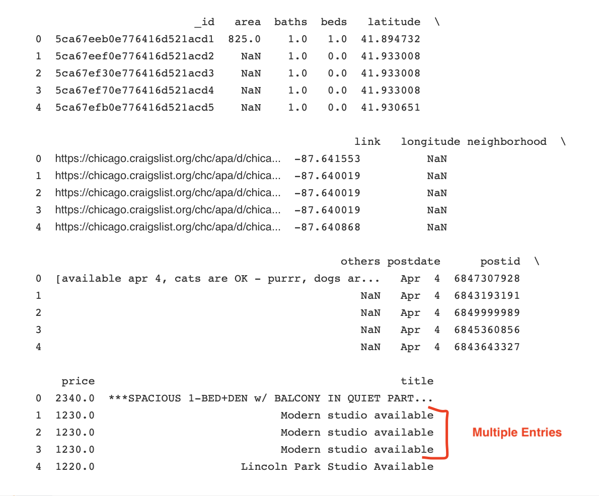

<div class="right">

- The scraped data requires some cleaning/preprocessing:

    -removing duplicate entries

    -Dealing with missing values

    -type conversion when necessary

    -Dealing with extreme outliers
</div>
---

## Missing Values

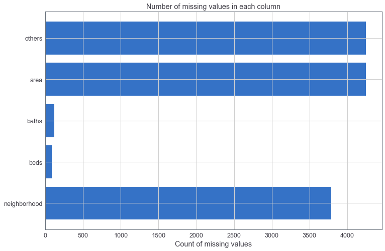
<div class="right">

- Missing values in each column.
- Many properties do not list area/neighborhood.
- The other information is not very helpful. This column was not used.
- Reconstructed neighborhood from latitude/longitude
- Filled missing beds/baths with median values.
</div>
---

## Outliers

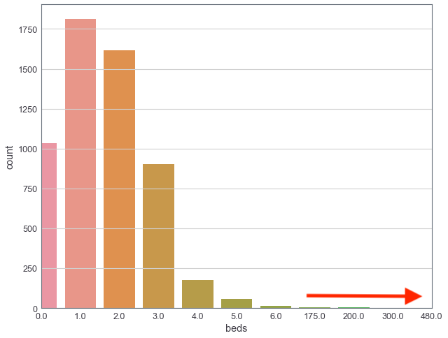
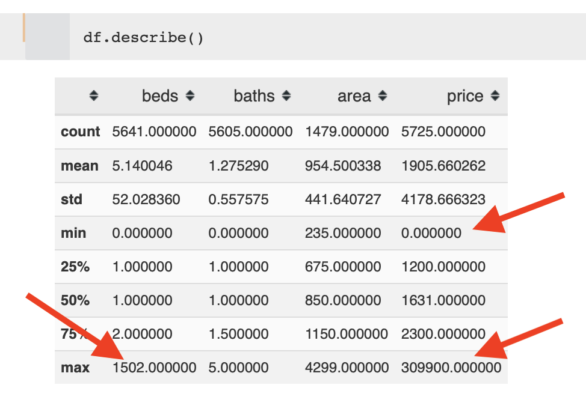

- examples: way too many beds, extreme prices etc.

---

#

## Exploratory Analysis

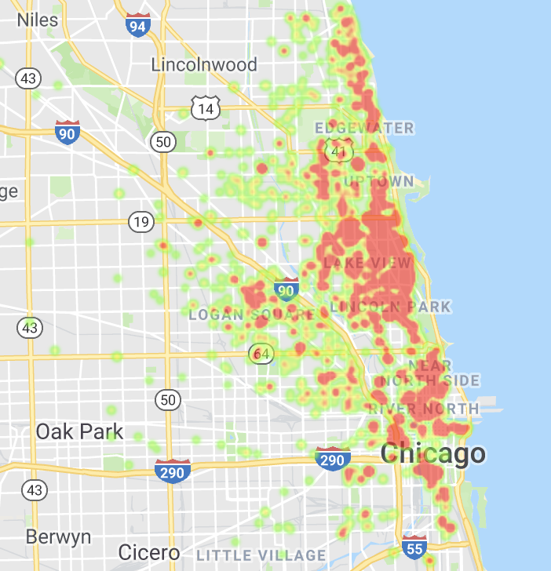
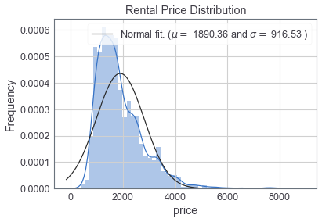

- The price is not normally distributed, is skewed to the right.

- Linear model is not a good option, can try to log-transform the price.

---

## Exploratory Analysis

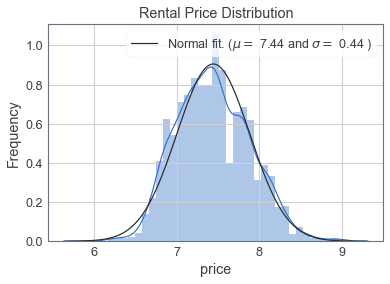

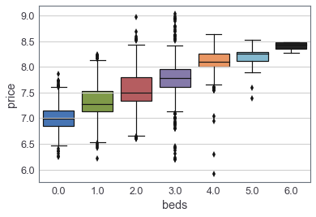

- Log-transformed price is normally distributed.

---

#

## Feature Engineering
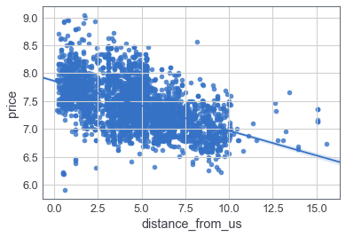
<div class="right">
- Distance from the city center (Union Station)

```
def get_distance_from_union_station(lon2, lat2):
    # convert decimal degrees to radians
    lon1 = -87.6403 ## Union Station Coordinates
    lat1 = 41.8787
    lon1, lat1, lon2, lat2 = map(np.deg2rad, [lon1, lat1, lon2, lat2])
    # haversine formula
    dlon = lon2 - lon1
    dlat = lat2 - lat1
    a = np.sin(dlat / 2)**2 + np.cos(lat1) * np.cos(lat2) * np.sin(dlon / 2)**2
    c = 2 * np.arcsin(np.sqrt(a))
    r = 3956  # Radius of earth in miles
    return c * r
```
</div>
- Transform latitude, longitude to neighborhoods, use one-hot-encoded neighborhood as the model Feature.


---

## Correlation Matrix

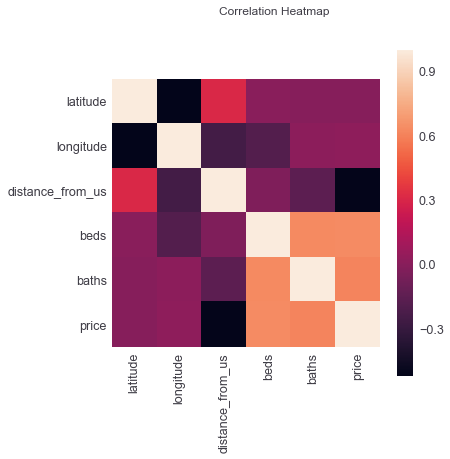
<div class="right">
- The price is anti-correlated with the distance from the union station and correlated with beds/baths
- The latitude/longitude gets encoded into neighborhoods, I did not use them in the final model.

</div>

---

#

## Modeling

- Randomly split data into training and testing sample (70/30 split)
- Fitted couple different models on the training set and evaluated model performance on the test set
- Used MSE criteria for model evaluation
- Linear model did not perform well as the relationship is not linear.
- Tree based ensemble model (RandomForest and Gradient Boosting Model) showed similar performance with GBM performing slightly better.
- GBM model was further tuned using Randomized Search Cross Validation technique to optimize hyper-parameters.


## Model Performance

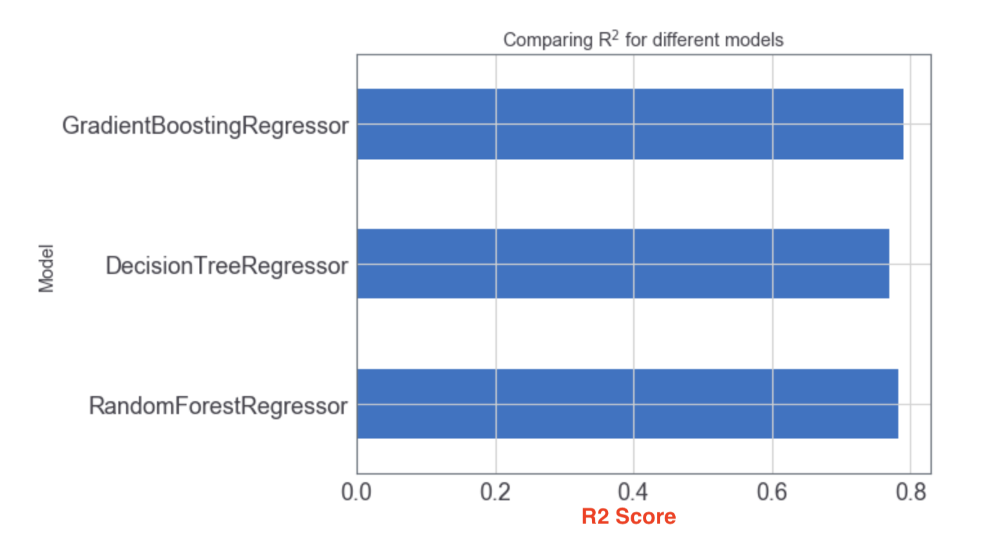
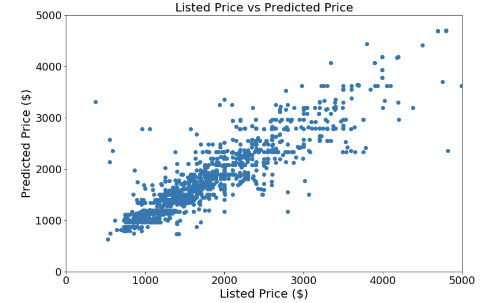

---

## Model Performance

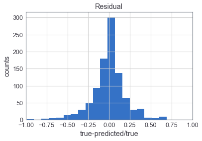

#

## Model Deployment
- Picklized the final model and wrote a flask application deployed as an heroku app.
- [Deployed Model in Heroku ](https://chi-apt-rental-app.herokuapp.com)
